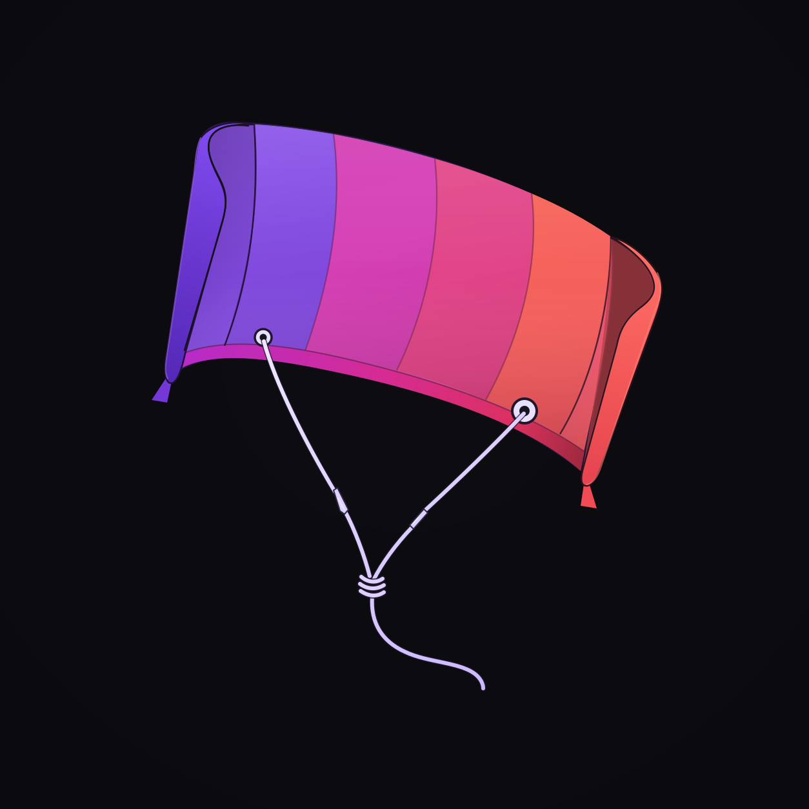

# KitePlayer

<p align="center">
  
</p>

A media player for Kotlin Multiplatform, with a Kotlin engine and FFmpeg decoding compiled into
the artifacts.

[](https://github.com/yuroyami/KitePlayer/actions/workflows/ci.yml)
[](https://central.sonatype.com/artifact/io.github.yuroyami/kiteplayer)
[](https://kotlinlang.org)
[](LICENSE)

**[Documentation](docs/)** · [Changelog](CHANGELOG.md) · [Contributing](CONTRIBUTING.md)

Things people build with it:

- A video screen in a Compose Multiplatform app, on Android, iOS and desktop
- A player inside an Android XML layout or a UIKit view, with no Compose at all
- An audio player with a ten band equaliser, ReplayGain, balance and a sleep timer
- A player for subtitle heavy content: SSA and ASS drawn by libass, plus SubRip and WebVTT

KitePlayer does not wrap ExoPlayer, AVPlayer or libmpv. Seeking, audio and video sync and the
state machine live in one Kotlin engine, so they behave the same on every platform. FFmpeg comes
through [KiteFFmpeg](https://github.com/yuroyami/KiteFFmpeg) and is compiled into the artifacts.
You do not install FFmpeg, add a Gradle plugin or touch linker settings.

> **Early software.** KitePlayer is 0.0.x. It plays real media on Android, iOS, macOS and the
> desktop JVM, and it runs inside a shipping app. The public API will still change. Read
> [What is missing](#what-is-missing) before you plan around it.

## Install

```kotlin
/** Native views, no Compose. The default stack. */
implementation("io.github.yuroyami:kiteplayer:0.0.23")

/** Compose. Everything above, plus both Compose video paths. */
implementation("io.github.yuroyami:kiteplayer-compose:0.0.23")

/** Optional, next to either line: an audio visualiser for files with no picture, in Compose. */
implementation("io.github.yuroyami:kiteplayer-audioviz:0.0.23")
```

Put the line in `commonMain.dependencies`, or in the `dependencies` block of an Android-only app.
Every artifact lives under `io.github.yuroyami`. Gradle picks the platform pieces for each target
you declare.

What each line pulls in:

```text
kiteplayer-compose
├── kiteplayer
│   ├── kiteplayer-core
│   │   └── kiteplayer-rt            native targets only
│   ├── kiteplayer-ffmpeg            decoders over KiteFFmpeg
│   │   └── kiteplayer-subtitles
│   ├── kiteplayer-output            audio output, subtitle rasterisers
│   ├── kiteplayer-view-bindings     adapters for the native views
│   │   └── kiteplayer-view
│   ├── kiteplayer-network           HTTP and HTTPS
│   └── kiteplayer-libass            ASS and SSA typesetting
├── kiteplayer-compose-ui
│   ├── kiteplayer-compose-interop   Compose hosting the native view
│   └── kiteplayer-compose-video     Compose drawing the frames itself
└── kiteplayer-phone                 deprecated

kiteplayer-audioviz                  optional audio visualiser over Kite3D
└── kiteplayer-core
```

[Modules](#modules) says what each one is for.

## Play something

Three steps: create a player, show it, open something.

```kotlin
val player = KitePlayerPlatform.createOrNull()
    ?: error("KitePlayer cannot run here: ${KitePlayerPlatform.availability}")
```

In Compose, show the player with `KitePlayerVideo`:

```kotlin
KitePlayerVideo(player = player, modifier = Modifier.fillMaxSize())
```

For a native view, create the view, install its renderer binding and hand it the player:

| Platform | View | Binding |
|---|---|---|
| Android | `KitePlayerView`, from XML or code | `view.installMobileRenderer()` |
| iOS | `KitePlayerUIView` | `view.installMobileRenderer()` |
| Desktop JVM | `KitePlayerAwtView` | `view.installDesktopRenderer()` |

```kotlin
view.installMobileRenderer()
view.player = player
```

Then open media from a coroutine you own, once the view or composable is on screen. `open`,
`seek` and `closeAndAwait` suspend. `play` and `pause` do not.

```kotlin
player.open(MediaItem("https://example.com/movie.mkv"))
player.play()
player.seek(90.seconds)

// When the screen goes away:
player.closeAndAwait()
```

`KitePlayerVideo` has two ways to draw. `KiteRenderPath.NativeView` hosts the platform's video
view: the system compositor presents the frames and the GPU stays idle, which is the right default
for long playback. `KiteRenderPath.ComposeCanvas` draws the frames inside Compose, so the video
takes clipping, alpha and shared element transitions. The default, `Auto`, picks the native view.
You can switch at runtime; the Android sample app has a button for it.

One desktop detail: macOS gives a click to the topmost native view, so Compose controls drawn over
a native view video are painted but never pressed. Use the canvas path there, or keep the controls
beside the video.

## What you can control

Everything here works during playback. Everything is published on `player.state`, so your UI can
read it back.

| | |
|---|---|
| Playback | `open`, `play`, `pause`, `stop`, `seek`, `stepFrame`, `close`, `closeAndAwait` |
| Queue | `openQueue`, `next`, `previous`, `setLoop`, and `addToQueue`, `removeFromQueue`, `moveInQueue`, `clearQueue` while it plays |
| Shuffle | `setShuffle`. The items never move. `queueOrder` tells you what plays next |
| Speed | `setSpeed`, 0.25x to 4x with pitch preserved. `setPreservePitch(false)` lets the pitch change like a tape |
| Sound | `setVolume`, `setMuted`, `setBalance`, `setEqualizer` (ten bands and a preamp), `setAudioDelay`, `setSleepTimer` (with a fade), `setVideoEnabled(false)` for audio only |
| Loudness | `PlayerConfig.audio.volumeCeiling` allows volume up to 2.0 through a limiter. `PlayerConfig.audio.replayGain` applies the file's own ReplayGain tags, off by default |
| Picture | `setVideoScale` (fit, fill, stretch), `setVideoAdjustments` (brightness, contrast, saturation, hue), `setVideoTransform` (forced aspect, zoom, pan) |
| Subtitles | `selectTrack`, `selectSecondarySubtitle`, `addExternalSubtitle`, `setSubtitleScale`, `setSubtitleDelay`, `setSubtitlePosition`, `setSubtitleStyle`, and `subtitleCues` for drawing the lines yourself |
| Sections | `setAbLoop` repeats between two points. `setMarkers` fires an event when playback crosses a position |
| Chapters | `chapterAt`, `seekToChapter`, `nextChapter`, `previousChapter` |
| Resume | `memento()` saves item, position, tracks and speed. `restore(memento)` puts them back |
| Screenshots | `captureFrame`. `kiteplayer-ffmpeg` encodes the frame to PNG or JPEG, and makes thumbnails and waveforms |
| Rendering | `attachRenderer`, `detachRenderer`, swappable while media plays |
| Diagnosis | `diagnosticsDump`, `warningHistory`, `supportBundle`, and `KiteLog` as the one logging seam, silent by default |

Five flows tell your UI what is happening: `state`, `progress`, `stats`, `events` and
`subtitleCues`. `position()` reads the current time without collecting anything.

Two seek modes matter. `SeekMode.Precise` is the default. `SeekMode.KeyframeThenRefine` shows the
nearest keyframe at once and replaces it with the exact frame a moment later, which is what makes
scrubbing feel instant on large files.

`MediaItem` carries the per-item settings: `headers` for HTTP, `startPosition` to begin partway in,
`externalSubtitles`, `videoFilter` for an FFmpeg filter chain, and `formatHint` when a container
needs naming.

Anything the player cannot do is refused with a typed error, never accepted and ignored. Two
players in one process work and are tested.

## Subtitles

- SubRip, WebVTT and SubStation Alpha, from the container or from an external file. External
  files load in the middle of playback.
- ASS and SSA tracks are drawn by libass, as authored: moving signs, animated transforms, karaoke
  fills, clips and vector drawings. They re-render every video frame while they move.
- Fonts attached to a Matroska file are loaded for the track. `SubtitleConfig.fonts` adds your own.
  On Android and Linux the module also loads a bounded set of system font files.
- `SubtitleConfig.typesetting = false` keeps the built-in Kotlin styling instead of libass.
  `PlayerSnapshot.subtitleTypesetter` says which engine is drawing.
- A typeset ASS track ignores `SubtitleStyleOverride`. Scale and position still apply. Only the
  primary track is typeset; a secondary track uses the built-in styling at the top of the picture.
- On the web, libass is a separate module. `kiteass.mjs` and `kiteass.wasm` come as the `web` zip
  attached to the wasmJs artifact; unpack them beside `index.html`. A browser has no system font,
  so supply fonts as attachments or through `SubtitleConfig.fonts`.

## Network

HTTP and HTTPS work as soon as `kiteplayer-network` is on the classpath, and every standard entry
point includes it. You do not build a resolver or a Ktor client.

- Android and the JVM use OkHttp with the platform trust store. Apple uses NSURLSession. The
  browser uses its own HTTP stack.
- The Android artifact declares the `INTERNET` permission for you. Cleartext HTTP follows your
  app's own policy.
- Order of precedence: the item's own `io` source, then a resolver you set in
  `NetworkConfig.ioResolver`, then the automatic provider. `NetworkConfig.autoResolve = false`
  turns the automatic provider off.
- `MediaItem.headers` reach whichever transport is selected.
- No HTTP client exists until network media is opened, and the reader that created one closes it.

## Audio visualiser

`kiteplayer-audioviz` draws the sound when the media has no picture. Add it next to your KitePlayer
line and show it in place of the video when `isAudioOnly` says so:

```kotlin
val viz = rememberAudioVizState(player)
val snapshot by player.state.collectAsState()

if (snapshot.isAudioOnly) {
    KiteAudioViz(viz, Modifier.fillMaxSize())
} else {
    KitePlayerVideo(player = player, modifier = Modifier.fillMaxSize())
}
```

- The state listens to the decoded audio through `KitePlayer.attachAudioTap`, so the picture
  follows the sound, through seeks and track changes too. Create it where you create the player's
  screen, not inside the audio-only branch, so it is already listening when a song starts.
- Album art does not count as a picture. The player selects it as the video track when a file has
  nothing else.
- `viz.drawing`, `viz.palette` and `viz.directed` choose what is drawn. With `directed` on, the
  director changes drawings on the song's phrases. `viz.mutate()` changes the current drawing's
  recipe now.
- `AudioVizBrowser(viz)` shows every drawing live in a searchable grid. `AudioVizSettings(viz)`
  holds the drawing's own settings, the palette and the finishing pass.
- `VizPalette.fromImage` builds a palette from a picture, such as an album cover.
- The toolkit the drawings are written with is public behind `@AudioVizAuthoringApi`.

## Where it runs

| | |
|---|---|
| Plays real media | Android (device and emulator), iOS (device and simulator), macOS arm64, desktop JVM on macOS arm64, Linux x64 and arm64 |
| Builds and links, nothing has run | Windows x64 |
| Compiles only | iOS x64, tvOS, watchOS, Android native. The JavaScript facade reports unavailable |
| Web | wasmJs plays through the FFmpeg Wasm module with browser audio. Load `KiteFFmpegWeb` before creating a player. This is not broad browser qualification |

Android and iOS are the platforms in daily use. macOS arm64 is the development machine and has the
deepest automated coverage. Linux plays through Kotlin/Native but has no audio device sink yet.
The desktop JVM works on macOS arm64 only for now: the KiteFFmpeg 0.2.0 JVM artifact bundles only
that native library, and the player cannot fill that gap.

Every CI run of the format matrix writes a conformance table, uploaded as the
`conformance-macos-host` artifact and printed in the run summary. It lists each clip, what was
asked of it, and what happened.

## What is missing

- Adaptive streaming. Single file HTTP and HTTPS with an in-memory byte cache is there. HLS and
  DASH with bitrate switching and persistent caching are not.
- Audio resampling quality. Rate conversion is linear interpolation, which dulls the top end of
  music. libswresample replaces it before 1.0.
- Linux audio output. The engine plays; there is no ALSA sink.
- Desktop JVM outside macOS arm64, see above.
- A stable API. Public declarations are checked against committed ABI dumps, so a change fails
  the build here rather than surprising you. That is visibility, not a promise.
- AV1 on the web. Native targets have dav1d with full SIMD, and hardware AV1 where it exists. The
  Wasm build is single threaded and dav1d needs threads, so the web has no software AV1.
- An automated device farm. Device results are checked by hand, not on every push.

Everything else that is open lives in [GitHub Issues](https://github.com/yuroyami/KitePlayer/issues).

## Modules

| Artifact | What it is |
|---|---|
| `kiteplayer-compose` | Everything in `kiteplayer`, plus both Compose video paths and the switch between them. The complete Compose entry point. |
| `kiteplayer` | The default playback stack for native views: engine, FFmpeg decoders, audio output, view adapters, HTTP and HTTPS, libass. |
| `kiteplayer-compose-ui` | Compose presentation only: `KitePlayerVideo` and both video paths. No player factory, no network. |
| `kiteplayer-compose-interop` | Compose hosting the platform's native video view. |
| `kiteplayer-compose-video` | Video drawn by Compose itself. |
| `kiteplayer-audioviz` | Optional. An audio visualiser for files with no picture: 78 drawings, palettes, and a director that changes drawings with the music. |
| `kiteplayer-view` | The native views: `KitePlayerView` on Android, `KitePlayerUIView` on iOS, `KitePlayerAwtView` on the desktop JVM. |
| `kiteplayer-view-bindings` | The FFmpeg adapters those views need. |
| `kiteplayer-core` | The engine and its service interfaces. Depends on coroutines only. |
| `kiteplayer-ffmpeg` | Media source and decoders over KiteFFmpeg. Also snapshots, thumbnails, waveforms and the subtitle parsers. |
| `kiteplayer-network` | HTTP and HTTPS transport through Ktor. Registers itself. |
| `kiteplayer-libass` | The libass typesetter for ASS and SSA. Registers itself. |
| `kiteplayer-output` | Platform audio output, render support and the subtitle rasterisers. |
| `kiteplayer-subtitles` | SubRip, WebVTT and ASS dialogue parsers, in Kotlin. |
| `kiteplayer-rt` | The real-time audio ring, in C. Comes with `kiteplayer-core` on native targets. Never add it yourself. |
| `kiteplayer-phone` | Deprecated. `kiteplayer` plus `kiteplayer-view`. |

Compose presentation and the visualiser target Android, iOS arm64, the iOS simulator and the desktop JVM.

Custom assemblies start from `kiteplayer-core` and supply their own backends through
`KitePlayer.create(PlayerConfig(backends = Backends(backend, output)))`. The
[SPI cookbook](docs/spi-cookbook.md) walks through one, and the
[module contract](docs/module-contract.md) says what each entry point promises.

## Samples

Four sample apps live in this repository, and three of them share one screen. None of them is
published. The desktop, Android and iOS apps open on the audio visualiser, playing the song set as
`kiteplayer.sample.song` in `local.properties`. No song is committed; without one they play the
test clip as video and say how to set one up.

| Module | What it shows | Run it |
|---|---|---|
| `kiteplayer-sample` | A macOS window on the native views, and an iOS app that opens on the shared screen | `./gradlew :kiteplayer-sample:linkDebugExecutableMacosArm64`, then `kiteplayer-sample/build/bin/macosArm64/debugExecutable/kiteplayer.kexe testmedia/sync1080p30.mp4 --window`. For iOS, `./gradlew :kiteplayer-sample:linkDebugFrameworkIosSimulatorArm64` and open `kiteplayer-sample/iosApp/KitePlayerSample.xcodeproj` |
| `kiteplayer-sample-android` | The shared screen, and behind Other samples the XML view, Compose hosting the native view, Compose drawing the frames, and a button that swaps between the two | `./gradlew :kiteplayer-sample-android:installDebug` |
| `kiteplayer-sample-desktop` | The shared screen in a window; with `--modifiers`, the Compose drawn path, clipped and animated | `./gradlew :kiteplayer-sample-desktop:run`, or add `--args='--modifiers'` |
| `kiteplayer-sample-shared` | The screen the three apps share: the visualiser, the drawing browser, the settings and the transport | Used by the three above |
| `kiteplayer-sample-web` | The wasmJs measurement harness, not a demo | `./gradlew :kiteplayer-sample-web:wasmJsBrowserDistribution`, then read `kiteplayer-sample-web/MEASUREMENTS.md` |

The test clips come from `./scripts/testmedia.sh`, which needs `ffmpeg` on your PATH. No media is
committed to this repository. For the visualiser, put `kiteplayer.sample.song=/path/to/song.mp3`
in `local.properties`.

## Working on KitePlayer

[CONTRIBUTING.md](CONTRIBUTING.md) has the ground rules, the build prerequisites and the test gate.
The short version:

```bash
./scripts/testmedia.sh          # generate the test clips, needs ffmpeg on PATH
./scripts/check-gate.sh tier1   # the checks every change runs
```

## License

Apache-2.0. See [NOTICE](NOTICE).

Decoding is done by [KiteFFmpeg](https://github.com/yuroyami/KiteFFmpeg), which compiles FFmpeg
into its own artifacts under the LGPL. Shipping LGPL code obliges you to say your app uses FFmpeg
and to keep its source available; KiteFFmpeg's `NOTICE` states this precisely. `kiteplayer-libass`
links libass, HarfBuzz, FreeType and FriBidi; their licence texts ship inside the artifact.

Part of the Kite family: [KiteFFmpeg](https://github.com/yuroyami/KiteFFmpeg),
[KiteCore](https://github.com/yuroyami/KiteCore), [KitePDF](https://github.com/yuroyami/KitePDF),
[KiteImage](https://github.com/yuroyami/KiteImage), [KiteQR](https://github.com/yuroyami/KiteQR).
