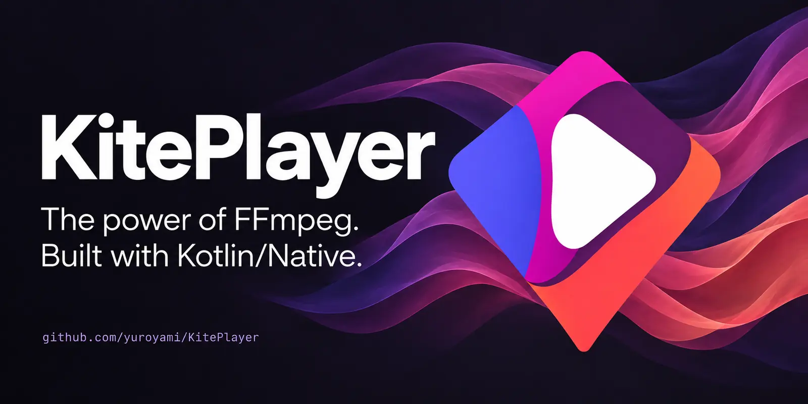
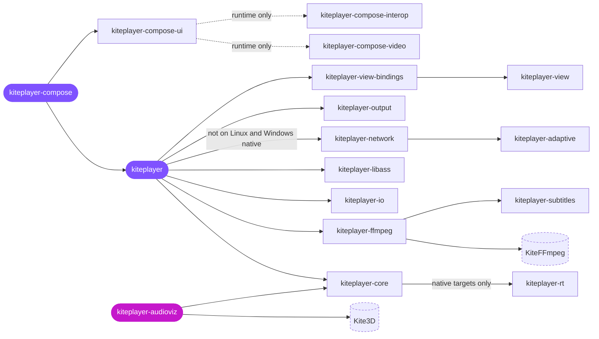
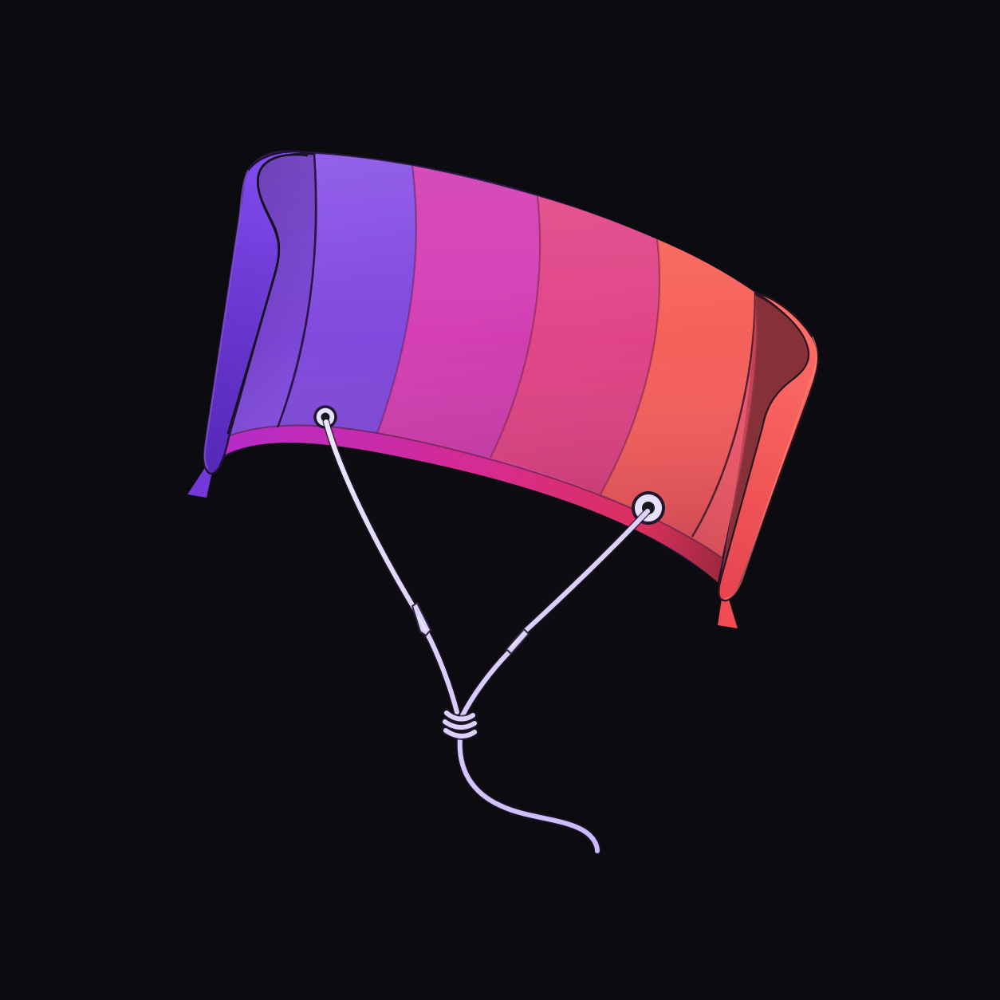

<a name="top"></a>
<p align="center">
  <picture>
    <source media="(prefers-color-scheme: dark)" srcset="art/readme/kiteplayer-banner-curtains.webp">
    <source media="(prefers-color-scheme: light)" srcset="art/readme/kiteplayer-banner-matte.webp">
    
  </picture>
</p>

<p align="center">
  A media playback library for Kotlin Multiplatform apps. Its engine is written in Kotlin and plays
  video, audio and subtitles on Android, iOS, macOS, the desktop JVM and the web, with FFmpeg already
  inside the artifacts through <a href="https://github.com/yuroyami/KiteFFmpeg">KiteFFmpeg</a>. It
  takes mpv and VLC as its models, and aims for their performance and range of features.
</p>

<p align="center">
  <kbd>&nbsp;Android&nbsp;</kbd>&nbsp;
  <kbd>&nbsp;iOS&nbsp;</kbd>&nbsp;
  <kbd>&nbsp;macOS&nbsp;</kbd>&nbsp;
  <kbd>&nbsp;Desktop JVM&nbsp;</kbd>&nbsp;
  <kbd>&nbsp;Web&nbsp;</kbd>
</p>

<p align="center">
  <a href="https://central.sonatype.com/artifact/io.github.yuroyami/kiteplayer"></a>
  <a href="https://github.com/yuroyami/KitePlayer/actions/workflows/ci.yml"></a>
  <a href="https://kotlinlang.org"></a>
  <a href="https://www.jetbrains.com/compose-multiplatform/"></a>
  <a href="LICENSE"></a>
</p>

<p align="center">
  <a href="#install"><b>Install</b></a>&ensp;·&ensp;
  <a href="#play-something"><b>Play something</b></a>&ensp;·&ensp;
  <a href="#what-you-can-control"><b>Control</b></a>&ensp;·&ensp;
  <a href="#subtitles"><b>Subtitles</b></a>&ensp;·&ensp;
  <a href="#network"><b>Network</b></a>&ensp;·&ensp;
  <a href="#where-it-runs"><b>Platforms</b></a>&ensp;·&ensp;
  <a href="#modules"><b>Modules</b></a>
  <br>
  <sub><a href="docs/README.md">Guides</a>&ensp;·&ensp;<a href="https://yuroyami.github.io/KitePlayer/">API reference</a>&ensp;·&ensp;<a href="CHANGELOG.md">Changelog</a>&ensp;·&ensp;<a href="CONTRIBUTING.md">Contributing</a></sub>
</p>

## What it is

<table>
<tr>
<td width="50%" valign="top">

**A library, not an app.**<br>
You add KitePlayer to your app with one Gradle line. Your code gets a player object, and your
screen shows the video in a native view or a Compose composable. The sample apps in this repository
only show how to use the library.

</td>
<td width="50%" valign="top">

**Its own engine, not a wrapper.**<br>
KitePlayer does not put a common API over ExoPlayer, AVPlayer, mpv or VLC. The seeking, the audio
and video sync, the subtitle timing and the playback state are KitePlayer's own Kotlin code, so
every platform behaves the same way.

</td>
</tr>
<tr>
<td width="50%" valign="top">

**FFmpeg inside.**<br>
FFmpeg reads and decodes the media, through [KiteFFmpeg](https://github.com/yuroyami/KiteFFmpeg).
Its libraries come inside the artifacts that Gradle downloads.

</td>
<td width="50%" valign="top">

**Little from the platform.**<br>
Each platform supplies an audio output, a video surface and, where the device has one, a hardware
video decoder.

</td>
</tr>
</table>

## What you get

<table>
<tr>
<td width="50%" valign="top">

**Formats**

- Video: H.264, H.265 (HEVC) in 8 and 10 bit, AV1, VP9, MPEG-2, MPEG-4 Part 2 and the rest of
  what FFmpeg decodes.
- Audio: AAC, MP3, Opus, Vorbis, FLAC, ALAC, AC-3, E-AC-3, DTS, TrueHD and PCM.
- Containers: MKV, WebM, MP4, MOV, MPEG-TS, AVI, FLV, VOB, WMV, WAV and raw streams.
- A transport stream with several channels, such as a DVB recording or an IPTV multiplex, plays one
  channel's tracks together. `Tracks.programs` lists the channels, `DemuxPolicy.program` picks one
  before the open and `KitePlayer.selectProgram` switches while playing.
- Hardware decoding through MediaCodec on Android and VideoToolbox on Apple, with software decoding
  when the device cannot. AV1 decodes with dav1d where the device has no AV1 hardware.
- The web build carries a smaller set: H.264, HEVC, VP9, AAC, MP3, Opus, Vorbis, FLAC and PCM, in
  MP4, MOV, MKV, WebM, MP3 and FLAC files.

</td>
<td width="50%" valign="top">

**Picture**

- True HDR: HDR10 and HLG show as HDR on a display that can show it, through Metal on a Mac or an
  iPhone and through `KitePlayerView` on an Android HDR display. Elsewhere they are tone mapped.
- Dolby Vision: profile 5 and 10.0 are composed into HDR10 on the processor, which keeps up at
  1080p, and each scene's own brightness guides the tone mapping.
- Picture-in-picture on Android, iOS, macOS and in the browser, and a floating window on the
  desktop JVM.
- Rotation and mirroring from the file, on every renderer, and the viewer's own quarter turns and
  mirrors on top.
- Fit, fill and stretch, zoom, pan and a forced aspect ratio. Brightness, contrast, saturation and
  hue.
- Dithering, debanding, a sharper scaler and an upscaler for animation, on Apple's Metal renderer
  and Android's GPU renderer.
- A native view on each platform, or Compose with two paths: the platform's video view, or video
  drawn by Compose that takes clipping, alpha and shared element transitions.
- Frame stepping, screenshots to PNG or JPEG, and thumbnails.

</td>
</tr>
<tr>
<td width="50%" valign="top">

**Sound**

- Speed from 0.25x to 4x with the pitch kept. A speed change while it plays makes no pause and no
  gap.
- A ten band equaliser with a preamp, balance, ReplayGain, volume up to twice the normal level
  through a limiter, audio delay, and a sleep timer that fades out.
- A stereo mode: mono, left only, right only or swapped, after the downmix, with no click on a
  change ([#462](https://github.com/yuroyami/KitePlayer/issues/462)).
- Surround folds into the speakers the device has, and mono or stereo can fill a surround device.
  Apple outputs take up to 7.1, and an iPhone tells the system when an item is surround, so a
  receiver or headphones that place sound in space can take it.
- A choice of output device on macOS and the desktop JVM.
- Audio files and streams beside the video, such as a dub or a commentary, as tracks of the item
  ([#392](https://github.com/yuroyami/KitePlayer/issues/392)).
- Waveforms, and an optional audio visualiser for media with no picture.

</td>
<td width="50%" valign="top">

**Subtitles**

- ASS and SSA drawn by libass as authored: signs, karaoke, animated transforms and the fonts the
  file carries.
- SubRip and WebVTT, DVB teletext, and Blu-ray (PGS), DVD, DVB and XSUB image subtitles.
- External subtitle files that load during playback, and a second subtitle track at the same time.
- Delay, scale, position, style and a safe area that keeps text out of cutouts and controls.

</td>
</tr>
<tr>
<td width="50%" valign="top">

**Streaming and input**

- HTTP and HTTPS with your headers, through OkHttp on Android and the JVM and NSURLSession on
  Apple.
- HLS: master playlists, a choice of variant, automatic steps down and up with the network rate,
  MPEG-TS and fMP4 segments, AES-128, separate audio and subtitle renditions, IMSC (TTML)
  subtitle renditions, served to FFmpeg as WebVTT, backup variants tried when a server fails, and
  live playlists. A DASH manifest's backup `BaseURL`s are tried the same way.
- DASH through the HLS path, for fMP4, MPEG-TS and WebM segments: separate video, audio and
  subtitle sets, seeking, a variant for each video representation, segment indexes of single
  files, live manifests, and manifests of several Periods, joined into one presentation. TTML and
  MP4 subtitle sets play as WebVTT. A DASH or HLS address plays as it is, recognised by its content
  type, its extension or its first bytes.
- Lists of streams, as radio stations hand them out: a PLS file, or an M3U list that is not HLS.
- Files, memory, bytes that your code pushes, streams, and Android content URIs and assets.
- Recording of what plays into a Matroska file, with no re-encode.

</td>
<td width="50%" valign="top">

**Playback**

- A gapless queue, shuffle, loops, chapters, an A-B loop and position markers.
- Precise seeks, or the nearest keyframe at once and the exact frame a moment later for fast
  scrubbing.
- Resume: one call saves the item, the position, the tracks and the speed.
- An external clock that playback follows, for watching together.
- Typed errors and warnings, a diagnostics dump, and a trace that Perfetto opens.

</td>
</tr>
<tr>
<td colspan="2" valign="top">

**On the device**

- A media notification and lock screen controls on Android and iOS, and playback in the
  background.
- Screen reader labels on the views and both Compose paths.

</td>
</tr>
</table>

Not every platform has every feature. [Where it runs](#where-it-runs) and [Limits](#limits) say
what is missing where.

This desktop JVM program plays a song, seeks, and closes the player:

```kotlin
import io.github.yuroyami.kiteplayer.KitePlayer
import io.github.yuroyami.kiteplayer.MediaItem
import kotlinx.coroutines.delay
import kotlinx.coroutines.runBlocking
import kotlin.time.Duration.Companion.seconds

fun main() = runBlocking {
    val player = KitePlayer()
    player.open(MediaItem("/path/to/song.mp3"))   // returns when the item is open and paused
    player.play()
    delay(10.seconds)
    player.seek(60.seconds)                       // returns when the seek has landed
    delay(10.seconds)
    player.closeAndAwait()
}
```

> [!NOTE]
> KitePlayer has not reached 1.0. It plays real media on Android, iOS, macOS and the desktop JVM,
> and it runs inside a shipping app, but the API can still change between versions. Read [Limits](#limits)
> before you plan around it.

## Install

Pick one line. Both pull in the whole playback stack, and Gradle picks the platform pieces for
each target you declare.

```kotlin
commonMain.dependencies {
    implementation("io.github.yuroyami:kiteplayer:0.3.0")            // native views, no Compose
    // or
    implementation("io.github.yuroyami:kiteplayer-compose:0.3.0")    // Compose, plus everything above

    implementation("io.github.yuroyami:kiteplayer-audioviz:0.3.0")   // optional: a visualiser for audio
}
```

You do not install FFmpeg, and there is no Gradle plugin. On Android, every artifact needs
`minSdk` 26 or higher. In an Android-only app, put the line in your usual `dependencies { }` block.
[Modules](#modules) draws what each line pulls in.

### What else you need

> [!IMPORTANT]
> Some setups need one more step. Without it, the link, the App Store upload, the first call or
> background playback fails.

| If you build | You also need |
| --- | --- |
| An iOS app with a **static** framework (`isStatic = true`) | **Linker flags** in Xcode. See [iOS setup](#ios-setup). |
| Any iOS app | **Two privacy manifest entries**, for boot time and file timestamp APIs. See [iOS setup](#ios-setup). |
| A web app (`wasmJs`) | **Two WebAssembly modules** that the page serves, for FFmpeg and libass, and a third for the worker player. See [Web setup](#web-setup). |
| Playback that goes on in the background on Android | **A service and three permissions** in your manifest. See [Background playback](#background-playback). |

<a name="ios-setup"></a>
<details name="setup">
<summary><b>iOS setup</b>: the linker flags and the privacy manifest entries</summary>
<br>

A dynamic framework needs no flags, because Kotlin links it with the system frameworks. A static
framework is linked by Xcode instead, so add this to Other Linker Flags:

```text
-ObjC -lz -framework CoreFoundation -framework CoreMedia -framework CoreVideo -framework VideoToolbox -framework AudioToolbox
```

KitePlayer times playback with `mach_absolute_time`, which Apple lists as a system boot time API.
It also reads file sizes and dates with `stat`, `fstat` and `lstat`, from FFmpeg's file reader, the
libass chain and its own file readers, which Apple lists as file timestamp APIs. App Store Connect
refuses the upload (ITMS-91053) until both are declared in `PrivacyInfo.xcprivacy`. Keep only the
reasons that apply to your app: `35F9.1` is time measured between events inside the app, `C617.1`
is files inside the app container, and `3B52.1` is files that the user picked.

```xml
<key>NSPrivacyAccessedAPITypes</key>
<array>
    <dict>
        <key>NSPrivacyAccessedAPIType</key>
        <string>NSPrivacyAccessedAPICategorySystemBootTime</string>
        <key>NSPrivacyAccessedAPITypeReasons</key>
        <array><string>35F9.1</string></array>
    </dict>
    <dict>
        <key>NSPrivacyAccessedAPIType</key>
        <string>NSPrivacyAccessedAPICategoryFileTimestamp</string>
        <key>NSPrivacyAccessedAPITypeReasons</key>
        <array><string>C617.1</string><string>3B52.1</string></array>
    </dict>
</array>
```

For background audio, declare `UIBackgroundModes` with `audio` in `Info.plist`.

</details>

<a name="web-setup"></a>
<details name="setup">
<summary><b>Web setup</b>: the modules a page serves</summary>
<br>

A browser cannot link FFmpeg or libass into the Kotlin binary, so the page serves them as two
WebAssembly modules. Each one comes as a `web` zip beside its artifact on Maven Central:

1. Unpack `kiteffmpeg-wasm-js-<version>-web.zip` beside `index.html`, with the KiteFFmpeg version
   that KitePlayer depends on (0.5.1 for 0.3.0). The page then serves `kite.mjs`, `kite.wasm`
   and `licenses/`.
2. Unpack `kiteplayer-libass-wasm-js-<version>-web.zip` there too, for `kiteass.mjs` and
   `kiteass.wasm`. The first ASS track loads them. Without them, ASS falls back to the built-in
   styling.
3. Call `KiteFFmpegWeb.load()` before you create a player. It fetches `./kite.mjs`. Under a
   bundler, instantiate the module from a plain `<script type="module">` and pass it to
   `KiteFFmpegWeb.attach()` instead.

Serve `.mjs` as `text/javascript` and `.wasm` as `application/wasm`. With gzip, the codec module is
about 1.42 MiB to download, and CI holds it to that.[^web-size] Both modules are single-threaded,
so the page needs no cross-origin isolation headers. A browser starts audio only after the user
interacts with the page, so the position stays at zero until then. A player on the page's own
thread does not play network media, so play files from memory, as [Network](#network) says, or use
the worker player.

`KitePlayerWorker.start(canvas)` runs the player in a web worker, so opening, decoding and drawing
leave the page's thread free (#100). The worker draws on the canvas and sends its sound straight to
the page's audio device, and it plays `http`, `https` and `blob` addresses. It loads a third module:
unpack `kiteplayer-wasm-js-<version>-web.zip` beside `index.html` too, for
`kiteplayer-web-worker.mjs` and the three files beside it. With gzip it is about 0.50 MiB to
download, and CI holds it to 0.53 MiB. The worker player has the calls and flows of `KitePlayer`
with the same names, except those its KDoc lists, such as `captureFrame` and recording. A setter
it refuses arrives on `events` as `CommandRefused` rather than throwing at the call. An item, an
external subtitle or an external audio input with a reader of its own cannot cross to the worker;
give it an address. The
worker loads `kiteass.mjs` from beside the page too, so the libass web zip from step 2 serves
both players; pass another `libassUrl` to `KitePlayerWorker.start` if the files live elsewhere.
`pictureInPictureOrNull()` puts the worker's canvas in a picture in picture window, as
`KitePlayerPictureInPicture` does for the page's own player.

A multi-threaded codec module would need the page served with
`Cross-Origin-Opener-Policy: same-origin` and `Cross-Origin-Embedder-Policy: require-corp`, and
imported without them it hangs rather than failing. `KiteWebModules.codecModuleUrl(threaded = ...)`
names it only on a page that has them, and the single-threaded module otherwise; pass its answer to
`KiteFFmpegWeb.load` or `KitePlayerWorker.start`. KiteFFmpeg publishes only the single-threaded
module today.

</details>

## Play something

Three steps: create a player, show it, open something. The order of the last two does not
matter: media may open before the view is on screen.

### ❶ Create a player

```kotlin
import io.github.yuroyami.kiteplayer.KitePlayer

val player = KitePlayer()
```

`KitePlayer()` builds the player on this platform's default stack: FFmpeg, and the platform's own
audio output. Where the platform cannot play, it throws a `PlaybackException` that says why;
`KitePlayer.isAvailable` checks that first. Settings go in a block, for example
`KitePlayer { subtitles { preferredLanguages = listOf("ja") } }`.

### ❷ Show it

<details name="show" open>
<summary><b>In Compose</b>: <code>KitePlayerVideo</code></summary>
<br>

In Compose, `rememberKitePlayer()` builds the player and closes it when the composable leaves.
`KitePlayerVideo` shows it:

```kotlin
import androidx.compose.foundation.layout.fillMaxSize
import androidx.compose.runtime.LaunchedEffect
import androidx.compose.ui.Modifier
import io.github.yuroyami.kiteplayer.MediaItem
import io.github.yuroyami.kiteplayer.compose.KitePlayerVideo
import io.github.yuroyami.kiteplayer.compose.rememberKitePlayer

val player = rememberKitePlayer()
KitePlayerVideo(player, Modifier.fillMaxSize())
LaunchedEffect(Unit) {
    player.open(MediaItem("https://example.com/movie.mkv"))
    player.play()
}
```

> [!TIP]
> `KitePlayerVideo` draws in one of two ways. `KiteRenderPath.NativeView` hosts the platform's
> video view: the system compositor shows the frames and the GPU stays idle, which suits long
> playback, so it is the default. `KiteRenderPath.ComposeCanvas` draws the frames inside Compose,
> so the video takes clipping, alpha and shared element transitions. You can switch while it plays.

> [!WARNING]
> On macOS, a click goes to the topmost native view, so Compose controls drawn over a native view
> video are painted but never pressed. Use the canvas path there, or keep the controls beside the
> video.

The video has no controls until you ask for them. `KitePlayerControls` draws a default set over
it: play and pause, previous and next for a queue, the seek bar, the volume, and menus for the
audio and subtitle tracks, the quality and the speed. A tap on the picture shows or hides them.

```kotlin
KitePlayerVideo(player, Modifier.fillMaxSize()) { KitePlayerControls(player) }
```

Its words come from `KitePlayerControlsLabels`, in English unless you pass your own, and its look
from `KitePlayerControlsStyle`. For controls of your own, build them from the same state holders,
such as `rememberSeekBarState(player)` and `rememberTrackMenuState(player, TrackKind.Audio)`.

</details>

<details name="show">
<summary><b>In a native view</b>: <code>KitePlayerView</code>, <code>KitePlayerUIView</code>, <code>KitePlayerAwtView</code></summary>
<br>

For a native view, give the view the player. The views are in `io.github.yuroyami.kiteplayer.view`:
`KitePlayerView` on Android, from XML or code, `KitePlayerUIView` on iOS, and `KitePlayerAwtView` on
the desktop JVM.

```kotlin
view.player = player
```

A view has no controls until you ask for them. Each of the three views draws a default set from
its own toolkit, with no Compose:

```kotlin
view.showsControls = true
view.onFullScreen = { /* your window, your rule */ }
```

They have play and pause, previous and next, a seek bar with the buffered ranges, mute, and menus
for the audio tracks, the subtitles, the quality and the speed. Their words come from
`view.controlsStrings`, in English unless you pass your own `PlayerControlsStrings`. For controls of
your own in a native toolkit, read `PlayerControlsModel`: it holds the state and the commands, and
no toolkit.

A player from `KitePlayer()` gives the views their renderer. A player built with `KitePlayer.create`
on backends of your own also needs `view.installMobileRenderer()`, or `installDesktopRenderer()` on
the desktop, from `io.github.yuroyami.kiteplayer.mobile`.

While a video plays on screen, the display stays awake: every view, `KitePlayerVideo`, the Mac's
`AppKitVideoRenderer` and the web's canvas renderers hold it, and let it sleep at a pause, the end,
or with sound only. Pass `keepDisplayAwake = false` to turn that off. The desktop JVM has no way to
hold its display, so there it does nothing.

</details>

### ❸ Open something

Then open media from a coroutine that you own. A call that takes time suspends until it is done:
`open`, `seek` and `closeAndAwait`. `play`, `pause` and the setters return at once.
`requestSeek` is the seek that does not wait, for a seek bar being dragged.

```kotlin
import io.github.yuroyami.kiteplayer.MediaItem
import kotlin.time.Duration.Companion.seconds

player.open(MediaItem("https://example.com/movie.mkv"))
player.play()
player.seek(90.seconds)

// When the screen goes away, unless rememberKitePlayer owns the player:
player.closeAndAwait()
```

<details>
<summary><b>From Java</b>: listeners, futures and milliseconds</summary>
<br>

The player speaks in coroutines and flows, which Java cannot call. On Android and the desktop JVM,
`KitePlayerJava` adds what Java lacks: listeners called on an executor you name, a
`CompletableFuture` version of every call that suspends, and milliseconds wherever the Kotlin call
takes a `Duration`. `MediaItemBuilder` makes the item, and `PlayerConfigBuilder` the settings.

```java
KitePlayerJava player = KitePlayerJava.create();
player.addListener(new KitePlayerListener() {
    @Override
    public void onState(PlayerSnapshot state) {
        statusView.setText(state.getStatus().name());
    }

    @Override
    public void onProgress(Progress progress) {
        seekBar.setProgress((int) progress.getPositionMillis());
    }
}, ContextCompat.getMainExecutor(context));

player.openAsync(new MediaItemBuilder("https://example.com/movie.mkv").build())
        .thenRun(() -> player.getPlayer().play());
player.seekAsync(90_000);

// When the screen goes away:
player.close();
```

Cancelling a future cancels its call, as cancelling the coroutine does in Kotlin. Every other call,
such as `play()`, `pause()` and `setVolume(float)`, is on `getPlayer()`.

> [!NOTE]
> A listener hears each event that happens after it is added, and none from before: the player
> replays no event.

</details>

## Media that is not a URL

A file path or a URL needs nothing more. `MediaItem("/sdcard/movie.mkv")` goes straight to
FFmpeg's own file reader, which is the fastest way to read a local file. So does the address a
Compose Multiplatform resource has, on every target: `MediaItem(Res.getUri("files/intro.mp4"))`
plays the bundled file, from the app's assets on Android and from the app's jar on the desktop.
On Android that reads the assets through the application context, which a small content provider
of `kiteplayer-io` keeps from the moment the app starts, as Compose's own resources do.

For anything else, use a **door**: a function that turns what you have into a `MediaIoFactory`
for the item's `io` field. Each open of the item gets a new reader from it, because a track switch,
a loop or a recovery opens the item again.

| You have | Door | Where |
| --- | --- | --- |
| A `ByteArray` | `MediaIo.ofBytes(bytes)` | <kbd>Everywhere</kbd> |
| Bytes that your code pushes, from a socket or a decryptor | `PipedMediaIo`, a new one in each open | <kbd>Everywhere</kbd> |
| A `File` or a `Path` | `MediaIo.ofFile(file)`, `MediaIo.ofPath(path)` | <kbd>JVM</kbd> <kbd>Android</kbd> |
| A `FileChannel` that you keep open | `MediaIo.ofChannel(channel)` | <kbd>JVM</kbd> <kbd>Android</kbd> |
| An `InputStream` | `MediaIo.ofStream { openStream() }` | <kbd>JVM</kbd> <kbd>Android</kbd> |
| A `content://` URI, such as one from the file picker | `MediaIo.ofUri(contentResolver, uri)` | <kbd>Android</kbd> |
| A file in the app's `assets` | `MediaIo.ofAsset(assets, "clip.mp4")` | <kbd>Android</kbd> |
| A Compose Multiplatform resource's `Res.getUri` address, when you set a resolver of your own | `MediaIo.ofResourceUri(context, uri)`, `MediaIo.ofResourceUri(uri)` | <kbd>Android</kbd> <kbd>JVM</kbd> |
| A path that every read must pass through Kotlin | `MediaIo.ofPath("/path/to/clip.mp4")` | <kbd>Apple</kbd> <kbd>Linux</kbd> |
| A file URL, such as one from the document picker | `MediaIo.ofUrl(url)` | <kbd>Apple</kbd> |

```kotlin
import io.github.yuroyami.kiteplayer.MediaIo
import io.github.yuroyami.kiteplayer.MediaItem
import io.github.yuroyami.kiteplayer.from
import io.github.yuroyami.kiteplayer.io.ofUri

player.open(MediaItem.from(MediaIo.ofUri(contentResolver, uri), label = "picked.mkv"))
player.play()
```

The label names the item in logs and helps FFmpeg guess the format. A stream and a pipe read
forward only, so the player cannot seek in them. `MediaIo.ofBytes` does not copy the array, so keep
it unchanged while playback can read it. The first two doors are in `kiteplayer-core`, and the
others in `kiteplayer-io`, which comes with `kiteplayer`.

A file that is still being written, such as a recording in progress or a download that plays as it
arrives, plays to its current end and on as it grows when the item says so:
`MediaItem(path, growth = FileGrowth())`. The player waits at the end for more, and ends the item
once the file has not grown for `FileGrowth.endsAfter`, two seconds by default. Its length grows
with the file, and a seek reaches any part already written. A plain path needs `kiteplayer-io` for
this; an item with its own `io` needs nothing more.

<details>
<summary><b>Several settings on one item</b>: headers, probing and low latency</summary>
<br>

Build the item in a block. An empty block gives the same item as `MediaItem(uri)`.

```kotlin
import io.github.yuroyami.kiteplayer.CorruptPackets
import io.github.yuroyami.kiteplayer.ProbeDepth
import io.github.yuroyami.kiteplayer.mediaItem

val item = mediaItem("https://cdn.example.com/live/channel.ts") {
    header("Authorization", "Bearer $token")
    probe(ProbeDepth.Fast)
    corruptPackets(CorruptPackets.Drop)
    lowLatency()
}
```

`probe`, `corruptPackets`, `lowLatency` and the other demux settings say how the container opens,
and they fill the item's `demux` field. Raw FFmpeg options still go in `openOptions`, but an option
that a typed field also sets refuses the open with a typed error. `MediaItem` also carries
`startPosition`, `externalSubtitles`, `externalAudio`, `videoFilter` for an FFmpeg filter chain,
and `formatHint` when a container needs naming.

An item can play audio files or streams beside its media. Each one is an external audio input.

```kotlin
val item = mediaItem("https://cdn.example.com/film.mp4") {
    externalAudio(AudioSource("https://cdn.example.com/film.fr.m4a", title = "French", language = "fr"))
}
```

- The audio tracks of each input are listed in `tracks.audio`, after the media's own tracks.
- `selectTrack(TrackKind.Audio, id)` plays one. The player reads only the input that is heard.
- The open still chooses the media's own sound first. With no sound in the media, it chooses the
  first input.
- A seek moves the media and the input together. An input shorter than the media goes silent at
  its end.
- An input that cannot open is left out with the warning `AudioSourceUnreadable`. The item still
  plays.

</details>

## What you can control

Everything here works during playback, and everything is published on `player.state`, so your UI
can read it back.

| Area | What to call |
| --- | --- |
| **Playback** | `open`, `play`, `pause`, `stop`, `seek`, `requestSeek`, `stepFrame`, `close`, `closeAndAwait` |
| **Queue** | `openQueue`, `next`, `previous`, `setLoop`, and `addToQueue`, `removeFromQueue`, `moveInQueue`, `clearQueue` while it plays. Items follow each other on the same audio device with no gap; `PlayerConfig.queue` turns that off, and [the gapless design](docs/gapless-queue.md) says when an item opens from scratch instead. `QueueConfig.onItemFailure` makes the queue skip an item that cannot be opened rather than stop on it. `openPlaylist` opens an M3U, PLS or XSPF file, or an album's cue sheet as its tracks, which play on one open of the file with every sample heard once, as the queue, and `readPlaylist` hands its items over to filter or reorder first |
| **Shuffle** | `setShuffle`. The items never move. `queueOrder` tells you what plays next. `QueueConfig.reshuffleEachLap` draws a new order on each lap under `LoopMode.All` |
| **Speed** | `setSpeed`, 0.25x to 4x with the pitch kept. `setPreservePitch(false)` lets the pitch change like a tape. `setPitch` moves the pitch by up to an octave in semitones without changing the speed |
| **Sync** | `setExternalClock` makes playback follow a clock your app owns, for watching together. A small difference closes through a speed change of at most 0.5 percent with the pitch kept, and a jump is one seek. Play and pause stay with your commands |
| **Sound** | `setVolume`, `setMuted`, `setBalance`, `setStereoMode` (mono, one side only, or swapped), `setNightMode` (quiet speech up, loud effects down), `setDialogueLevel` (the centre of a downmix up or down), `setSkipSilence` (every pause longer than a fifth of a second cut down to that, for podcasts and audiobooks), `setEqualizer` (ten bands and a preamp), `setAudioDelay`, `setSleepTimer` (with a fade), `setVideoEnabled(false)` for audio only |
| **Loudness** | `PlayerConfig.audio.volumeCeiling` allows volume up to 2.0 through a limiter. `PlayerConfig.audio.replayGain` applies the file's own ReplayGain tags, off by default |
| **Surround** | Multichannel audio folds into the speakers the device has. `PlayerConfig.audio.upmix = UpmixMode.Surround` also plays mono and stereo from the other speakers of a surround device, off by default |
| **Picture** | `setVideoScale` (fit, fill, stretch), `setVideoAdjustments` (brightness, contrast, saturation, hue), `setVideoTransform` (forced aspect, zoom, pan, quarter turns, mirrors) |
| **HDR** | `setHdrPolicy`. HDR10 and HLG show as HDR on a display that can: through Metal on a Mac or an iPhone with extended range, and through `KitePlayerView` on an Android HDR display. Elsewhere they are tone mapped, and `PlaybackWarning.HdrToneMapped` says so. `HdrPolicy.ToneMap` tone maps everywhere, and `videoDynamicRange` says what the screen shows. `TrackInfo.dolbyVision` names a Dolby Vision track's profile, and a profile 5 or 10.0 track is composed into HDR10 on the processor |
| **Subtitles** | `selectTrack`, `selectSecondarySubtitle`, `addExternalSubtitle`, `seekToSubtitleLine` (the line showing, the previous or the next), `stepSubtitleDelay` (a line forward or back), `setSubtitleScale`, `setSubtitleDelay`, `setSubtitlePosition`, `setSubtitleStyle`, `setSubtitleSafeArea`, `setForcedPicturesOnly`, and `subtitleCues` to draw the lines yourself. `PlayerConfig.subtitles.secondaryLanguages` shows a second track in another language at each open, at the top or, with `secondaryPlacement`, directly above or below the first |
| **Sections** | `setAbLoop` repeats between two points. `setMarkers` fires an event when playback crosses a position |
| **Chapters** | `chapterAt`, `seekToChapter`, `nextChapter`, `previousChapter` |
| **Resume** | `memento()` saves the item, position, tracks and speed. `restore(memento)` puts them back |
| **Screenshots** | `captureFrame`. `kiteplayer-ffmpeg` encodes the frame to PNG or JPEG, and makes thumbnails and waveforms |
| **Recording** | `startRecording` copies what the player reads into a Matroska file, with no re-encode. `stopRecording` finishes the file. A seek ends a recording |
| **Rendering** | `attachRenderer`, `detachRenderer`, swappable while media plays. `attachRendererAndAwait` refuses a renderer that cannot show the running decoder's frames and keeps the one before |
| **Diagnosis** | `diagnosticsDump`, `warningHistory`, `supportBundle`, and `KiteLog` as the one logging seam, silent by default. `KiteTrace` records a timeline that Chrome's trace viewer and Perfetto open, also silent by default |

Five flows tell your UI what is happening: `state`, `progress`, `stats`, `events` and
`subtitleCues`. `position()` reads the current time without collecting anything. Anything the
player cannot do is refused with a typed error, never accepted and ignored, and two players in one
process work.

> [!TIP]
> `SeekMode.Precise` is the default seek. `SeekMode.KeyframeThenRefine` shows the nearest keyframe
> at once and replaces it with the exact frame a moment later, which makes scrubbing feel instant
> on large files.

<details>
<summary><b>Audio devices and screen readers</b></summary>
<br>

On the desktop JVM and on macOS, you choose the audio output device when you build the player.
`audioOutputDevices()` on `DesktopOutputBackend` or `AppleOutputBackend` lists the devices, and
`withAudioOutputDevice(id)` returns the backend bound to one, for `PlayerConfig.backends`. A bound
player never moves to another device: when its device is gone, the open fails with
`PlaybackError.AudioDeviceUnavailable`, and so does playback when the device disappears.
On Android and iOS the operating system owns the route.

The Android, iOS and desktop views, and both paths of `KitePlayerVideo`, tell a screen reader that
they are the video and what the player is doing, for example "Playing, 1:23 of 4:56".
`accessibilityVideoLabel` and `accessibilityStateFormat` take translated words. `KiteVideo`, the
bare canvas, gets its semantics from the modifier you pass. On the web, the page owns the canvas
and labels it.

</details>

## Subtitles

- SubRip, WebVTT and SubStation Alpha, from the container or from an external file. External files
  load in the middle of playback.
- Synced lyrics: an `.lrc` file, or LRC lines in a song's own tags (an ID3 `USLT` frame, a Vorbis
  or Matroska `LYRICS`, an MP4 `©lyr`), become a track that shows line by line through
  `subtitleCues`, selected when nothing else is. Lyrics without times are
  `PlayerSnapshot.lyrics`, for the application to show
  ([#443](https://github.com/yuroyami/KitePlayer/issues/443)).
- `SubtitleConfig.hearingImpairedNotes` hides the notes of subtitles made for deaf and
  hard-of-hearing viewers: `[DOOR SLAMS]`, a `(laughs)` that opens a line, `JOHN:` and `♪` music
  lines, and with `HideStrict` every parenthesis. ASS scripts are left alone
  ([#493](https://github.com/yuroyami/KitePlayer/issues/493)).
- An external file added without a language takes one from its name, as `Film.en.srt`,
  `Film.eng.forced.srt` and `Film.pt-BR.sdh.srt` say it, with `forced`, and `sdh`, `cc` or `hi`,
  marking the track, and a file in a preferred language is chosen at open over the container's
  track in a later one ([#514](https://github.com/yuroyami/KitePlayer/issues/514)).
- A subtitle the player chose by itself follows the audio: switching an anime to the English dub
  shows the English signs track made for it, and switching back shows every line again. One the
  viewer chose stays. `SubtitleConfig.withMatchingAudio`, as mpv's `subs-with-matching-audio`,
  keeps only forced tracks, or none, under audio in a preferred subtitle language
  ([#506](https://github.com/yuroyami/KitePlayer/issues/506)).
- WebVTT keeps its colours: the standard's colour classes such as `<c.yellow>` and `<c.bg_blue>`,
  and the `::cue` rules of its `STYLE` blocks for colour, background, bold, italic, underline,
  font and relative size, by class, voice and cue identifier. A rule that asks for anything more
  is ignored whole ([#498](https://github.com/yuroyami/KitePlayer/issues/498)). A
  `SubtitleStyleOverride` still wins over the file's colours.
- Blu-ray (PGS), DVB, DVD and XSUB image subtitles from the container, placed on the picture they
  were authored for.
- DVB teletext subtitles from a broadcast recording or an IPTV stream, read in Kotlin with no
  native library. Each subtitle page the channel lists is a track of its own, with its language
  and its hearing impaired mark, as VLC lists them, and a page shows its colours, its boxed
  backgrounds and its double height lines in the top or bottom half of the picture. The letters
  follow the page's national character set, Latin, Cyrillic, Greek or Hebrew, as libzvbi reads
  them ([#510](https://github.com/yuroyami/KitePlayer/issues/510)).
- The closed captions broadcast H.264, HEVC and MPEG-2 carry inside the picture, which have no
  subtitle stream of their own, become a track, CC1, from the first picture that carries any. Each
  screen shows as it is sent, as mpv shows them, and like a television the player shows them when
  the viewer's preferences or the viewer ask, not by default. Pictures a platform decoder draws
  straight to a surface carry none ([#236](https://github.com/yuroyami/KitePlayer/issues/236)).
- A disc's forced captions, the signs and foreign dialogue it marks forced among a Blu-ray or DVD
  track's pictures, can draw on their own. `setForcedPicturesOnly`, as mpv's
  `sub-forced-events-only`, draws only those of the chosen track, and
  `SubtitleConfig.forcedPicturesWhenOff` draws those of the track in the audio's language while no
  subtitle is chosen, following the audio, as Kodi does
  ([#513](https://github.com/yuroyami/KitePlayer/issues/513)).
- ASS and SSA tracks are drawn by libass as authored: moving signs, animated transforms, karaoke
  fills, clips and vector drawings. They re-render every video frame while they move.
- An ASS script's colours are matched to the video through its `YCbCr Matrix` header, as
  XySubFilter and libass's own notes ask, so a sign coloured to blend into the picture still blends
  in. A script with no header counts as BT.601 at studio range, `None` keeps its colours, and so do
  HDR and RGB video. The built-in styling does the same, and `SubtitleConfig.assColorMatching =
  false` keeps every colour as authored ([#499](https://github.com/yuroyami/KitePlayer/issues/499)).
- Fonts attached to a Matroska file load for the track, and `SubtitleConfig.fonts` adds your own.
  On Android and Linux, a bounded set of system fonts loads too.
- `setSubtitleSafeArea` keeps the built-in text out of a display cutout, rounded corners or a
  control bar. [Subtitle placement](docs/subtitle-placement.md) says where subtitles land on every
  renderer.

<details>
<summary><b>libass details</b>: typesetting choices and the web</summary>
<br>

- `SubtitleConfig.typesetting = false` keeps the built-in Kotlin styling instead of libass.
  `PlayerSnapshot.subtitleTypesetter` says which engine draws.
- A typeset ASS track ignores `SubtitleStyleOverride`. Scale and position still apply. Only the
  primary track is typeset; a secondary track uses the built-in styling at the top of the picture.
- On the web, libass is a separate module (see [Web setup](#web-setup)). A browser has no system
  font, so supply fonts as attachments or through `SubtitleConfig.fonts`.
- On the web, SubRip, WebVTT, TTML and the built-in ASS styling are drawn with the browser's own
  text engine and fonts, on the page and in the worker player. See
  [the web section of the regions document](docs/subtitle-regions.md#the-web).

</details>

## Network

HTTP and HTTPS work as soon as `kiteplayer-network` is on the classpath, and every standard entry
point includes it. You do not build a resolver or a Ktor client.

- Android and the JVM use OkHttp with the platform trust store, and Apple uses NSURLSession.
- `MediaItem.headers` reach whichever transport is selected.
- The Android artifact declares the `INTERNET` permission for you. Cleartext HTTP follows your app's
  own policy. It also declares `ACCESS_NETWORK_STATE`, which Android grants at install, and a
  provider that keeps the application context, so a player waiting for the network hears at once
  when it comes back.
- A drop of the network longer than the reader's reconnects fails the item. Set
  `NetworkConfig.recovery = NetworkRecovery()` and the player waits for the network instead, says
  so with `PlayerSnapshot.reconnecting`, and opens the item again where it was, or at the live
  edge, for up to `maxWait` ([#461](https://github.com/yuroyami/KitePlayer/issues/461)). It is off
  by default.
- In a browser, a player on the page's own thread cannot play network media, because a read cannot
  wait there. `KitePlayerWorker` plays it from a web worker
  ([#100](https://github.com/yuroyami/KitePlayer/issues/100)), see [Web setup](#web-setup). It
  downloads the whole file before it plays, up to 512 MiB. HLS plays there, one whole segment at a
  time, and changes variant in place. DASH does not play there yet
  ([#546](https://github.com/yuroyami/KitePlayer/issues/546)).
  On the page's thread, fetch the file and play it from memory with
  `MediaItem.from(MediaIo.ofBytes(bytes), name)`.

### HLS

HLS plays through the same transport. An address that ends in `.m3u8`, an HLS content type from
the server, or `formatHint = "hls"` marks a playlist. When none of those does, the first bytes do:
a playlist starts with `#EXTM3U`, so one behind an address with no extension, sent as text or as
bytes, plays too ([#400](https://github.com/yuroyami/KitePlayer/issues/400)).

- A master playlist plays one variant: the one that `DemuxPolicy.variant` names, or else the one
  with the highest bitrate within `DemuxPolicy.maxBitrate` and `DemuxPolicy.maxVideoHeight`.
  `Tracks.variants` lists the variants, and `KitePlayer.selectVariant` plays another one from the
  current position.
- A stream changes variant in place
  ([#464](https://github.com/yuroyami/KitePlayer/issues/464)). The stream stays open, and the next
  segment that the player has not read yet comes from the new variant. The picture changes quality
  with no pause, once the media that was already read has played. A live stream changes variant
  this way too. This needs variants that share their segment boundaries and their codec, as the
  HLS specification asks.
- MPEG-TS segments change as they are. fMP4 segments change when their pictures are H.264, HEVC,
  AV1 or VP9: the player writes each fragment again for the initialization the stream began with.
  H.264 and HEVC fragments get the variant's own parameter sets. AV1 and VP9 need nothing added,
  because their key frames state the picture size. The player decrypts AES-128 fMP4 segments
  itself, so each variant may have its own key.
- WebM segments in VP8, VP9 or AV1 change as they are when the variants' headers use the same
  timestamp scale, which packagers do
  ([#566](https://github.com/yuroyami/KitePlayer/issues/566)). Where only the track numbers differ,
  the player writes the first header's numbers into each cluster.
- A DASH manifest changes the same way, one of several Periods too.
- Any other change opens the stream again, so the picture holds for a moment: a variant of another
  codec, profile, bit depth or dynamic range, and variants that do not share their segment
  boundaries.
- The choice follows the screen ([#447](https://github.com/yuroyami/KitePlayer/issues/447)). An
  HDR version plays on a display that shows HDR as HDR, under `HdrPolicy.Auto`, and the SDR one
  elsewhere. Nothing larger plays than the smallest variant that fills the view the picture is
  drawn into, so a phone does not fetch 4K, and the cap rises when the view grows. The player reads
  both from the attached renderer at each open and each step. Set `DemuxPolicy.fit` to decide for
  it, and `VariantFit()` for no cap. A DASH manifest's transfer characteristics property counts as
  HLS's `VIDEO-RANGE`. The Apple renderers do not report HDR yet
  ([#540](https://github.com/yuroyami/KitePlayer/issues/540)).
- The player steps down when the stream reads slower than it plays, or when playback has waited
  4 s for data, and `PlaybackWarning.VariantLowered` says so.
- It steps up when the network carries the next higher variant with half again to spare and the
  buffer is full. The network reader measures that rate on its downloads, and reports it through
  `MediaIo.networkBitsPerSecond`. A reader of your own that answers null never steps up.
- A step up waits 30 s after a step down, and twice as long after each step up that did not last,
  up to 5 minutes.
- A step changes the variant in place where the stream allows it, and opens the stream again
  where it does not. A variant that you selected stays. A step up never passes
  `DemuxPolicy.maxBitrate`, `maxVideoHeight` or the fit, and never moves between SDR and HDR.
- MPEG-TS and fMP4 segments, byte ranges, AES-128 keys, separate audio and subtitle renditions, and
  live playlists play. A finished playlist can seek. A rendition's `NAME` is its track's title,
  and its `DEFAULT`, `FORCED` and accessibility `CHARACTERISTICS` set the track's flags.
- Only the audio rendition being heard is downloaded, so a stream with six languages does not pay
  for five that nobody hears. A switch to another language reads it from the moment playing: the
  picture and the old language go on until the new one is there, usually within a second, and the
  reads go back once over what they had read ahead. A file switches instantly, as before.
- Playlist variables play: `EXT-X-DEFINE` by `NAME` and `VALUE`, by `IMPORT` from the master
  playlist, and by `QUERYPARAM` from the playlist's own address, so a token in the master
  playlist's address reaches every variant, segment and key that names it. A playlist that was
  redirected takes its `QUERYPARAM` and its relative addresses from where it was redirected to. A
  reference to a variable that nothing defined fails the open, and the error names it.
- A segment that cannot be read is skipped, and `PlaybackWarning.SegmentSkipped` says so. A stream
  that ends while its last segments fail ends with `PlaybackError.SourceUnavailable`.
- `EXT-X-PROGRAM-DATE-TIME` gives each position the time of day it was broadcast
  ([#444](https://github.com/yuroyami/KitePlayer/issues/444)), in milliseconds since 1970 UTC.
  `Progress.timeOfDayMillis` publishes it for the position, and `firstTimeOfDayMillis` and
  `lastTimeOfDayMillis` for the moments the playlist lists, the last of a live one being its edge.
  `KitePlayer.timeOfDayAt` and `positionAtTimeOfDay` map both ways, `seekToTimeOfDay` goes to one
  in a stream that can seek, and `timeOfDayClock` makes two players on one live stream follow the
  same broadcast moment. A DASH manifest's `availabilityStartTime` gives the same. A playlist that
  names its segments through variables gives no time of day yet.
- `MediaItem.headers` go only to the scheme, host and port of the item's own address, because a
  playlist can name segments on any server.
- Your own `MediaIo` can serve HLS too: report the address it read in `location`, and open the
  addresses the playlist names in `openRelated`.

### Songs on a radio station

A Shoutcast or Icecast station names each song as it starts, and the player shows it when it is
heard rather than when it is read, seconds ahead
([#423](https://github.com/yuroyami/KitePlayer/issues/423)). The network reader asks for the
titles, takes the title blocks out of the bytes, and reads a title in windows-1251 or another
legacy table as the player reads a subtitle file. A chained Ogg's next song and the other tags a
stream changes while it plays arrive the same way.

- `PlayerSnapshot.metadata` holds the song as `StreamTitle`, beside the station's `icy-name`.
- The media session shows the song as the title and the station on the artist line.
- `setItemDetails` replaces the playing item's title, artist and album without opening it again,
  for a station that publishes its song list somewhere else. It and the station's next song replace
  each other, whichever came last.
- A reader of your own reports tags through `MediaIo.takeTags`.

### Lists of streams

A radio station's link is often a list that names its stream rather than the stream itself, and
it plays as it is ([#450](https://github.com/yuroyami/KitePlayer/issues/450)). A PLS file is
recognised by its `[playlist]` first line, an `audio/x-scpls` type or a `.pls` address, and an M3U
list by the same marks as an HLS playlist, but with no `#EXT-X-` tag in it.

- The first stream on the list that opens plays, so the backups a station lists after its main
  stream take over when that one is down. When none opens, the last failure is reported.
- The stream's title is the one the list gives it, `TitleN` in a PLS file and the `#EXTINF` text
  in an M3U list, unless the stream names itself.
- The streams open through the list's reader, on its client, so a `MediaIo` of your
  own serves them through `openRelated`, as for HLS. A list that names another list is followed,
  three levels deep at most.
- A station's server closes a listener's connection now and then, after a long pause, when its
  encoder restarts or when a load balancer moves the listener. A stream with no length and no
  ranges that carries Shoutcast or Icecast `icy-` headers connects again and goes on from the live
  edge, with `PlaybackWarning.SourceReconnecting` each time, and ends only when the station still
  answers 404 or 410 once the reconnects are spent
  ([#508](https://github.com/yuroyami/KitePlayer/issues/508)). Without those headers
  the stream ends where the server stops, because a media server that encodes a song as it sends
  it answers the same way, and asking it again would play the song again.

### DASH

A DASH address plays as it is, through the same transport, with no call to make. The manifest is
recognised by its `application/dash+xml` type, by a path that ends in `.mpd`, or, when the server
sends it as text, XML or bytes, by its root element
([#400](https://github.com/yuroyami/KitePlayer/issues/400)).

- A manifest whose picture and sound are fragmented MP4, MPEG-TS or WebM plays through the HLS
  path: each video representation is a variant, each audio set an audio rendition, and each
  subtitle set a subtitle rendition. FFmpeg's HLS reader reads WebM segments although the HLS
  specification names only the other two
  ([#401](https://github.com/yuroyami/KitePlayer/issues/401)). Separate sets play together, a finished presentation seeks, and a live one
  plays from its live edge and fetches the manifest again after each update period.
- A live manifest counts its window on the time of day its `UTCTiming` names, by `direct`,
  `http-xsdate`, `http-iso` or `http-head`, and falls back to the device's clock with a line in the
  log; a refresh follows its `Location`
  ([#404](https://github.com/yuroyami/KitePlayer/issues/404)). In a browser `http-head` answers
  only from a server that exposes its `Date` header.
- An audio or subtitle track takes its set's `Label` as its title, `main` sound is the default,
  `forced-subtitle` is a forced track, and `caption` and `description` are marked as
  accessibility tracks. Digital rights management is out of scope: an encrypted set is left out,
  and an encrypted manifest is refused with `DashUnsupportedException`.
- Segment templates, numbered or with a timeline, segment lists, and single files all play: an
  MP4 file through its segment index (`sidx`), and a WebM file through its `Cues`.
- Subtitle sets of WebVTT play as they are. Sets of TTML, and of TTML or WebVTT in MP4 segments
  (`stpp`, `wvtt`), are served to the player as WebVTT, with their text, line breaks, italic,
  bold and underline, but not their placement
  ([#402](https://github.com/yuroyami/KitePlayer/issues/402)).
- A manifest of several Periods, as ad insertion and chapters stitch them, plays as one
  presentation ([#403](https://github.com/yuroyami/KitePlayer/issues/403)). Each later Period
  gives each track the set with the same `id`, at the same place or in the same language, and the
  representation nearest its bandwidth. Time runs on across each boundary although each Period's
  media time starts again, an fMP4 Period of another picture size decodes at its own, because its
  H.264 or HEVC parameter sets travel with its keyframes, and a live manifest that a refresh gives
  a new Period plays on into it. An fMP4 Period in another codec than the first is skipped.
- `MediaItem.headers` go to the manifest and to the segments of its own scheme, host and port, as
  for HLS.
- `Dash.mediaItemFor` builds the item yourself, for a client of your own, a `DashUrlPolicy` other
  than the default, or other size ceilings. `Dash.manifest` reads a manifest without playing it.

### Keeping segments between sessions

A player downloads the segments of an HLS or DASH presentation again at each open. Give it a
segment store and a later player reads them from disk
([#547](https://github.com/yuroyami/KitePlayer/issues/547)). It is off by default.

```kotlin
val store = fileSegmentStore("$cacheDirectory/kite-segments", maxBytes = 512L * 1024 * 1024)
val player = KitePlayer.create(PlayerConfig(network = NetworkConfig(segmentStore = store)))
```

- Only the media and initialization segments of a presentation that has ended are kept.
  Playlists, manifests and keys are fetched each time, and a live stream keeps nothing.
- A stored segment is used by the rules of HTTP caching: with no request while it is fresh, and
  after one conditional request when it is not.
- The store never holds more than `maxBytes`. It removes the segments used longest ago.
- One store serves every player of the application. It works on the JVM, Android and Apple
  targets. A browser has none.

The [segment store guide](docs/segment-cache.md) has the whole rule.

<details>
<summary><b>Which transport wins</b>, and when a client exists</summary>
<br>

The item's own `io` source wins, then a resolver that you set in `NetworkConfig.ioResolver`, then
the automatic provider. `NetworkConfig.autoResolve = false` turns the automatic provider off. No
HTTP client exists until network media opens, and the reader that created one closes it.

</details>

## Background playback

Android stops a process that plays in the background unless a foreground service holds it.
`kiteplayer` has that service, `KitePlayerMediaService`, and your app declares it:

```xml
<uses-permission android:name="android.permission.FOREGROUND_SERVICE" />
<uses-permission android:name="android.permission.FOREGROUND_SERVICE_MEDIA_PLAYBACK" />
<uses-permission android:name="android.permission.WAKE_LOCK" />

<application>
    <service
        android:name="io.github.yuroyami.kiteplayer.session.KitePlayerMediaService"
        android:exported="false"
        android:foregroundServiceType="mediaPlayback" />
</application>
```

Then attach the media session. With notification options, it shows the media notification and
keeps the app playing in the background. It also takes audio focus, and it closes with the player.
`smallIcon` is your app's monochrome notification icon.

```kotlin
import io.github.yuroyami.kiteplayer.session.MediaNotificationOptions
import io.github.yuroyami.kiteplayer.session.attachMediaSession

player.attachMediaSession(context, MediaNotificationOptions(smallIcon = R.drawable.ic_notification))
```

On iOS, declare `UIBackgroundModes` with `audio` and call `player.attachMediaSession()` for the lock
screen. A native Mac app calls `player.attachMediaSession()` too: the player then shows in Now
Playing, the media keys and an AirPods tap control it, and it pauses when headphones disconnect
and the speakers take over. A desktop app keeps playing without
help, and a web page plays while its tab is open.

<details>
<summary><b>What the notification does</b>: buttons, wake locks and timeouts</summary>
<br>

- It shows the title, the artist, previous, play or pause, and next. Set `title`, `artist` and
  `album` on the `MediaItem` to choose them; otherwise they come from the file's tags, then its
  file name. `session.setCustomActions` adds your own buttons. The picture is the file's own
  cover when it carries one, and `session.setArtworkLoader` supplies another that wins over it.
  `player.coverArt` hands the cover's bytes to your own screens too.
- Skip back and skip forward move 15 seconds. Pass `skipInterval` to `attachMediaSession` for
  another interval.
- The session takes audio focus, so a call or another app pauses or ducks the player, and the
  player pauses when the headphones come out. The focus request and the audio track say whether
  the item is music, speech or a film, from `MediaItem.audioContent`, which by default says film
  for a picture and music for sound alone. `interruptions = null` turns that off, and
  `background = null` leaves the app's background behaviour alone.
- While the player plays or buffers, the notification keeps the processor and Wi-Fi awake, so a
  stream keeps loading with the screen off. That needs `WAKE_LOCK`. Pick another `wakeLocks` policy
  in `MediaNotificationOptions`, or `WakeLockPolicy.None` to hold nothing.
- After a pause, the service stays in the foreground for ten minutes (`pausedForegroundTimeout`).
  Then the notification can be swiped away, which stops the service and leaves the player paused.
- From Android 12, Android can refuse a start from the background. `onForegroundRefused` tells you,
  and the notification still shows. Android 13 and later need no notification permission for it.
- The library declares no service and no permission for background playback, so your manifest
  carries every entry above. The entries the library adds are `INTERNET` and
  `ACCESS_NETWORK_STATE`.

</details>

## Audio visualiser

`kiteplayer-audioviz` draws the sound when the media has no picture. Show it in place of the video
when `isAudioOnly` says so:

```kotlin
import androidx.compose.foundation.layout.fillMaxSize
import androidx.compose.runtime.collectAsState
import androidx.compose.runtime.getValue
import androidx.compose.ui.Modifier
import io.github.yuroyami.kiteplayer.audioviz.KiteAudioViz
import io.github.yuroyami.kiteplayer.audioviz.isAudioOnly
import io.github.yuroyami.kiteplayer.audioviz.rememberAudioVizState
import io.github.yuroyami.kiteplayer.compose.KitePlayerVideo

val viz = rememberAudioVizState(player)
val snapshot by player.state.collectAsState()

if (snapshot.isAudioOnly) {
    KiteAudioViz(viz, Modifier.fillMaxSize())
} else {
    KitePlayerVideo(player = player, modifier = Modifier.fillMaxSize())
}
```

Create the state where you create the player's screen, not inside the audio-only branch, so it is
already listening when a song starts. Album art does not count as a picture.

<details>
<summary><b>Choosing what it draws</b></summary>
<br>

- `viz.drawing`, `viz.palette` and `viz.directed` choose what is drawn. With `directed` on, the
  director changes drawings on the song's phrases. `viz.mutate()` changes the current drawing's
  recipe now.
- `AudioVizBrowser(viz)` shows every drawing live in a searchable grid. `AudioVizSettings(viz)`
  holds the drawing's own settings, the palette and the finishing pass.
- `VizPalette.fromImage` builds a palette from a picture, such as an album cover.
- `viz.reducedMotion` calms the picture; set it from your platform's own setting.
  `viz.framesPerSecond` caps the redraw rate, and `viz.visible = false` draws the background alone
  while the sound plays on.
- The toolkit the drawings are written with is public behind `@AudioVizAuthoringApi`.

</details>

## Where it runs

| Target | What runs, and where |
| --- | --- |
| **Android** | Plays real media on phones, checked by hand. CI runs the host tests, and an emulator job runs the device tests of five modules and the sample app on every push. A failure there does not fail the run yet. |
| **iOS** | Plays real media on devices, checked by hand. CI runs the tests of every iOS module on the simulator. |
| **macOS arm64**, native and desktop JVM | Plays real media. CI runs every module's tests on both, the format matrix included. |
| **Web**, wasmJs | Plays through the FFmpeg WebAssembly module with browser audio, from memory. `KitePlayerWorker` runs the player in a web worker, which plays single files, HLS streams and DASH manifests from the network too. CI runs the web tests under Node and in a headless browser. |
| **Linux and Windows**, native | No audio output and no HTTPS, so `KitePlayer()` throws and `KitePlayer.isAvailable` is false. Pass `KiteFFmpegMediaBackend()` and your own `OutputBackend` to `KitePlayer.create`. CI runs the media-free tests. |
| **Linux and Windows**, desktop JVM | The native libraries are linked. The Linux FFmpeg backend decodes in a container, and neither has played sound on a real machine. |
| **tvOS, watchOS, iOS x64, Android native** | Only the engine modules build there; CI runs the tvOS and watchOS tests on their simulators. |
| **js** | The facade reports unavailable. |

KitePlayer's JVM and Android classes are Java 11 bytecode, and so is the KiteFFmpeg 0.5.1 jar, so a
desktop app runs on Java 11 or later.

<details>
<summary><b>Which artifact publishes which target</b></summary>
<br>

iOS means `iosArm64` and `iosSimulatorArm64`; core, subtitles, io and rt also publish `iosX64`. The
last column covers `tvosArm64`, `tvosSimulatorArm64`, the four watchOS targets and the four Android
native targets. ✓ marks a target the artifact publishes, and · one it does not.

| Artifact | Android | iOS | macOS | JVM | Linux | Windows | wasmJs | js | tvOS, watchOS, Android native |
| --- | :---: | :---: | :---: | :---: | :---: | :---: | :---: | :---: | :---: |
| `kiteplayer-core`, `-subtitles`, `-io` | ✓ | ✓ | ✓ | ✓ | ✓ | ✓ | ✓ | ✓ | ✓ |
| `kiteplayer-rt` | · | ✓ | ✓ | · | ✓ | ✓ | · | · | ✓ |
| `kiteplayer`, `-libass` | ✓ | ✓ | ✓ | ✓ | ✓ | ✓ | ✓ | ✓ | · |
| `kiteplayer-ffmpeg`, `-output` | ✓ | ✓ | ✓ | ✓ | ✓ | ✓ | ✓ | · | · |
| `kiteplayer-network`, `-adaptive` | ✓ | ✓ | ✓ | ✓ | · | · | ✓ | ✓ | · |
| `kiteplayer-view` | ✓ | ✓ | ✓ | ✓ | · | · | ✓ | · | · |
| `kiteplayer-compose-interop` | ✓ | ✓ | · | ✓ | · | · | ✓ | ✓ | · |
| `kiteplayer-compose`, `-compose-ui`, `-compose-video`, `-view-bindings`, `-audioviz` | ✓ | ✓ | · | ✓ | · | · | · | · | · |

`kiteplayer-compose-interop`'s js and wasmJs variants draw an empty surface, so that shared Compose
code compiles for the web; they show no video. Every CI run of the format matrix writes a
conformance table, uploaded as the `conformance-macos-host` artifact and printed in the run
summary.

</details>

## Limits

| Topic | What to expect |
| --- | --- |
| **Adaptive streaming** | Single-file HTTP and HTTPS work, with an in-memory byte cache, everywhere. In the browser they work only in `KitePlayerWorker`, which downloads the whole file before it plays.<br><br>HLS plays one variant at a time, in `KitePlayerWorker` too. `selectVariant` changes it, and the player steps down and up by itself with the measured network rate. A stream of MPEG-TS segments, of fMP4 segments in H.264, HEVC, AV1 or VP9, or of WebM segments changes in place, with no pause, and so does a DASH manifest, one of several Periods too. Any other stream opens again for the change, which holds the picture for a moment.<br><br>A DASH manifest of fMP4, MPEG-TS or WebM segments plays through the HLS path, live ones included, with a variant for each video representation, from its address alone or through `Dash.mediaItemFor`, and a manifest of several Periods plays as one presentation. `KitePlayerWorker` plays a DASH manifest from its address too. A persistent cache does not work yet.<br><br>A seek bar's preview pictures come from the stream, an HLS image playlist or a DASH thumbnail set, or from a WebVTT thumbnail file that `MediaItem.thumbnails` names: `thumbnailAt` gives the grid image and the region of the tile for a position, downloaded only when asked ([#433](https://github.com/yuroyami/KitePlayer/issues/433)). |
| **Native Linux and Windows** | No audio output and no HTTPS. Use the desktop JVM target, or pass your own `OutputBackend`. |
| **Desktop JVM sound** | Plays on macOS. Linux and Windows have not played audio on a real machine. |
| **AV1 on the web** | There is no software AV1, because the web build has one thread and dav1d needs threads. Native targets decode AV1 with dav1d, and in hardware where the device has it. |
| **Android devices** | The emulator runs the device tests on a software GPU. What needs a real phone, such as frame pacing and GPU cost, is checked by hand. |
| **API stability** | Any release before 1.0 can change the API. Committed ABI dumps make each change visible in review, but they are not a promise. |

Everything else that is open lives in [GitHub Issues](https://github.com/yuroyami/KitePlayer/issues).

## Modules

What each install line pulls in. The violet boxes are the two lines you pick from, the magenta one
is the optional visualiser, and a dotted arrow is a dependency used at runtime only.


```mermaid
%%{init: {"flowchart": {"nodeSpacing": 14, "rankSpacing": 44}}}%%
flowchart LR
    classDef entry fill:#7F52FF,stroke:#7F52FF,color:#ffffff
    classDef optional fill:#C518CB,stroke:#C518CB,color:#ffffff
    classDef outside stroke-dasharray:4 3

    compose([kiteplayer-compose]):::entry
    kp([kiteplayer]):::entry

    compose --> ui[kiteplayer-compose-ui]
    ui -. runtime only .-> interop[kiteplayer-compose-interop]
    ui -. runtime only .-> cvideo[kiteplayer-compose-video]
    compose --> kp

    kp --> bindings[kiteplayer-view-bindings]
    bindings --> view[kiteplayer-view]
    kp --> output[kiteplayer-output]
    kp -- not on Linux and Windows native --> network[kiteplayer-network]
    network --> adaptive[kiteplayer-adaptive]
    kp --> libass[kiteplayer-libass]
    kp --> io[kiteplayer-io]
    kp --> ffmpeg[kiteplayer-ffmpeg]
    ffmpeg --> subs[kiteplayer-subtitles]
    ffmpeg --> kff[(KiteFFmpeg)]:::outside
    kp --> core[kiteplayer-core]
    core -- native targets only --> rt[kiteplayer-rt]

    viz([kiteplayer-audioviz]):::optional
    viz --> core
    viz --> k3d[(Kite3D)]:::outside
```

| Artifact | What it is |
| --- | --- |
| `kiteplayer-compose` | Everything in `kiteplayer`, plus both Compose video paths and the switch between them. The complete Compose entry point. |
| `kiteplayer` | The default playback stack for native views: engine, FFmpeg decoders, audio output, view adapters, HTTP and HTTPS, libass, input doors. |
| `kiteplayer-audioviz` | Optional. An audio visualiser for files with no picture: presets, palettes, and a director that changes drawings with the music. |
| `kiteplayer-compose-ui` | Compose presentation only: `KitePlayerVideo`, both video paths and the default controls, `KitePlayerControls`. No player factory, no network. |
| `kiteplayer-compose-interop` | Compose hosting the platform's native video view: `KitePlayerSurface`. `KitePlayerVideo` uses it at runtime; add it yourself only to call `KitePlayerSurface` directly. |
| `kiteplayer-compose-video` | Video drawn by Compose itself: `KiteVideo`. `KitePlayerVideo` uses it at runtime; add it yourself only to draw with `KiteVideo` directly, for example in a second window. |
| `kiteplayer-view` | The native views: `KitePlayerView` on Android, `KitePlayerUIView` on iOS, `KitePlayerAwtView` on the desktop JVM, and their default controls. |
| `kiteplayer-view-bindings` | The FFmpeg adapters those views need. |
| `kiteplayer-core` | The engine and its service interfaces. Depends on kotlinx.coroutines and atomicfu, and on `kiteplayer-rt` on native targets. |
| `kiteplayer-ffmpeg` | Media source and decoders over KiteFFmpeg, plus snapshots, thumbnails, waveforms and the subtitle parsers. |
| `kiteplayer-network` | HTTP and HTTPS through Ktor. Registers itself. |
| `kiteplayer-adaptive` | The DASH reader and the TTML subtitles of HLS, in Kotlin, with no HTTP client. Comes with `kiteplayer-network`. |
| `kiteplayer-io` | Input doors for platform types. Comes with `kiteplayer`. |
| `kiteplayer-libass` | The libass typesetter for ASS and SSA. Registers itself. |
| `kiteplayer-output` | Platform audio output, render support and the subtitle rasterisers. |
| `kiteplayer-subtitles` | SubRip, WebVTT, ASS dialogue and LRC lyrics parsers, in Kotlin. |
| `kiteplayer-rt` | The real-time audio ring, in C. Comes with `kiteplayer-core` on native targets; never add it yourself. |

To build your own stack, start from `kiteplayer-core` and supply backends through
`KitePlayer.create(PlayerConfig(backends = Backends(backend, output)))`. The
[SPI cookbook](docs/spi-cookbook.md) walks through one, and the
[module contract](docs/module-contract.md) says what each entry point promises.

## Good to know

<details name="more">
<summary><b>How it is tested</b></summary>
<br>

Each push runs the jobs in [`ci.yml`](.github/workflows/ci.yml): the real-media suites on macOS
arm64 (JVM and native), the iOS simulator suites and the iOS sample app, the tvOS and watchOS
simulators, the media-free suites on Linux x64 and Linux arm64, Windows x64 native, wasmJs under
Node and in a headless browser, the C audio ring under AddressSanitizer and ThreadSanitizer, and
the Android device tests on an emulator, whose failure does not fail the run yet. Before a commit,
`scripts/check-gate.sh` runs the local gate that [CONTRIBUTING.md](CONTRIBUTING.md) describes.

</details>

<details name="more">
<summary><b>Sample apps</b>: four apps, none of them published</summary>
<br>

The desktop, Android and iOS apps open on the audio visualiser, playing five songs by Skullbeatz
from the [Newgrounds Audio Portal](https://www.newgrounds.com/audio), under
[CC BY-SA 3.0](https://creativecommons.org/licenses/by-sa/3.0/).
[`kiteplayer-sample-shared/media/README.md`](kiteplayer-sample-shared/media/README.md) credits each
one. To play your own song, set `kiteplayer.sample.song=/path/to/song.mp3` in `local.properties`.
To play a file you pick: on Android, open Other samples and choose Play a file you pick; on iOS,
launch with `--uikit` and tap Open file.

| Module | What it shows | Run it |
| --- | --- | --- |
| `kiteplayer-sample-android` | The shared screen, and behind Other samples the XML view, both Compose paths, a button that swaps them, and a file picker | `./gradlew :kiteplayer-sample-android:installDebug` |
| `kiteplayer-sample-desktop` | The shared screen in a window; with `--modifiers`, the Compose drawn path, clipped and animated | `./gradlew :kiteplayer-sample-desktop:run`, or add `--args='--modifiers'` |
| `kiteplayer-sample` | A macOS window on the native views, and an iOS app on the shared screen, or on the native view with `--uikit` | `./gradlew :kiteplayer-sample:linkDebugExecutableMacosArm64`, then run `kiteplayer.kexe testmedia/sync1080p30.mp4 --window`; for iOS, link `linkDebugFrameworkIosSimulatorArm64` and open `kiteplayer-sample/iosApp/KitePlayerSample.xcodeproj` |
| `kiteplayer-sample-web` | The wasmJs measurement harness, not a demo | `./gradlew :kiteplayer-sample-web:wasmJsBrowserDistribution`, then read `kiteplayer-sample-web/MEASUREMENTS.md` |

`kiteplayer-sample-shared` is the screen that the first three share. The test clips come from
`./scripts/testmedia.sh`, which needs `ffmpeg` on your PATH, and are not committed.

</details>

<details name="more">
<summary><b>Working on KitePlayer</b>: for contributors</summary>
<br>

[CONTRIBUTING.md](CONTRIBUTING.md) has the ground rules, the build prerequisites and the test gate.
The short version:

```bash
./scripts/testmedia.sh          # generate the test clips, needs ffmpeg on PATH
./scripts/check-gate.sh tier1   # the checks every change runs
```

</details>

<details name="more">
<summary><b>Licensing</b>: what an app that ships these artifacts must do</summary>
<br>

KitePlayer is Apache-2.0. Decoding is done by [KiteFFmpeg](https://github.com/yuroyami/KiteFFmpeg),
which embeds FFmpeg (LGPL-2.1-or-later) and dav1d (BSD-2-Clause). `kiteplayer-libass` embeds libass
(ISC), HarfBuzz (MIT), FreeType (FreeType License) and FriBidi (LGPL-2.1-or-later), and its Windows
JVM adapter adds GNU libiconv (LGPL-2.0-or-later). An app that ships them has three LGPL duties for
FFmpeg, FriBidi and libiconv:

| Duty | How to meet it |
| --- | --- |
| Say that the app uses them, under the LGPL | Ship a notice with the licence texts, which the JVM and Android artifacts carry under `META-INF/licenses/`. |
| Make their source available to your users | Point at the source that KiteFFmpeg's `NOTICE` and this repository's [NOTICE](NOTICE) name. |
| Let users relink against a modified copy | The artifacts link them statically, so publish your object files, or give a written offer for them. |

KiteFFmpeg's [licensing guide](https://yuroyami.github.io/KiteFFmpeg/licensing/) explains the static
linking case in detail.

</details>

## License

Apache-2.0. See [NOTICE](NOTICE).

[^web-size]: Gzipped at level 9 by `scripts/check-web-size.sh`, which CI runs on every push. A
    module that grows past its budget fails the run.

<br>

<p align="center">
  
  <br>
  <sub>
    Part of the Kite family:
    <a href="https://github.com/yuroyami/KiteFFmpeg">KiteFFmpeg</a>&ensp;·&ensp;<a href="https://github.com/yuroyami/Kite3D">Kite3D</a>&ensp;·&ensp;<a href="https://github.com/yuroyami/KitePDF">KitePDF</a>
  </sub>
  <br>
  <sub><a href="#top">Back to top</a></sub>
</p>
