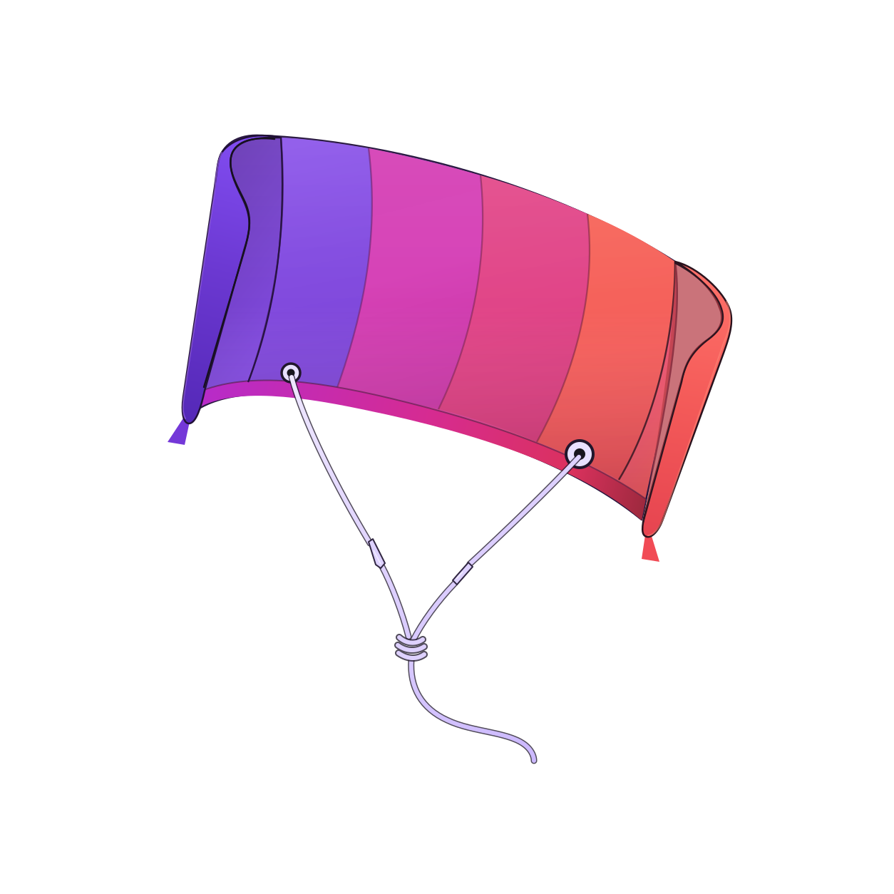

# KitePlayer logo

The chosen mark and its wordmark lock-up. Every exploration round that led here has been deleted;
this directory holds the result and nothing else.



## Files

| File | What it is |
|---|---|
| `final/kiteplayer-mark.svg` | The mark alone, transparent background. The source of truth for app icons and engine pickers. |
| `final/kiteplayer-logo.svg` | The mark with the wordmark, for READMEs and headers. |
| `final/kiteplayer-mark-preview.png` | Light-background render of the mark. |
| `final/kiteplayer-logo-preview.png` | Dark-background render of the lock-up. |
| `final/kiteplayer-logo-reference.png` | The reference render the vector was traced against. |
| `final/kiteplayer-logo-comparison.png` | Vector beside reference, for checking the trace. |
| `final/kiteplayer-logo-difference.png` | Per-pixel difference of those two. |

## The mark

A wind-filled bowed sled kite seen at an angle, with a bridle knot below it. It reads as a kite at
any size, and the taut bridle carries the idea of a stream held under tension, which is what a media
engine does.

## Colour

The sail runs the Kotlin gradient across five panels:

`#6534B5` → `#8149E0` → `#D53BB2` → `#DF4387` → `#F55C57`

The Kotlin palette comes from the official asset bundle. Kotlin's brand guidance reserves the
official mark for Kotlin itself, so this borrows the colour energy and none of the geometry:
[brand assets](https://kotlinlang.org/docs/kotlin-brand-assets.html) ·
[usage guidelines](https://kotlinfoundation.org/guidelines/)

## Rendering a raster

The SVG has no background rect, so any size rasterises with transparency intact:

```bash
rsvg-convert -w 150 -h 150 -f png -o kiteplayer.png final/kiteplayer-mark.svg
```

That 150 px form is what Syncplay uses for its engine picker.
